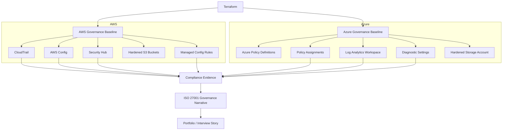

# Multi-Cloud Governance-as-Code Lab

<p align="center">
  <strong>A portfolio-ready cloud governance project spanning AWS, Azure, Terraform, and ISO/IEC 27001 thinking.</strong>
</p>

<p align="center">
  
  
  
  
  
  
  
</p>

---

## Why this repo exists

This project demonstrates how governance requirements can be translated into **repeatable, reviewable cloud controls** instead of staying trapped in policy documents, spreadsheets, or manual console work.

Using **Terraform**, **AWS native governance services**, and **Azure Policy / monitoring services**, this lab shows how to:

- codify baseline security guardrails
- deploy governance controls consistently across cloud platforms
- generate compliance-oriented evidence
- explain technical controls in the language of **risk, auditability, and ISO 27001**

It is designed to work as a **GitHub portfolio project**, **interview walkthrough**, **personal website case study**, or **Governance / GRC / cloud security demo**.

---

## What this project demonstrates

### Core capabilities

- **Terraform-based infrastructure and governance deployment**
- **AWS governance baseline** using CloudTrail, Config, Security Hub, and hardened S3
- **Azure governance baseline** using Azure Policy, Log Analytics, diagnostic settings, and hardened storage
- **Policy-as-Code thinking** through native cloud policy controls
- **ISO/IEC 27001:2022 mapping** from implemented controls to governance themes
- **Evidence-friendly design** suitable for demos, audits, and architecture discussions

### Skills highlighted

- AWS security and governance services
- Azure governance and compliance controls
- Terraform structure and modular design
- cloud logging and configuration monitoring
- control mapping and compliance storytelling
- platform governance architecture

---

## Architecture at a glance



### Architecture story

This repo follows a simple but credible governance model:

1. **Terraform** acts as the control delivery engine.
2. **AWS and Azure native services** provide monitoring, policy evaluation, and logging.
3. The resulting technical outputs support a broader **governance narrative** around visibility, consistency, and compliance.
4. Documentation connects these controls back to **ISO 27001-aligned governance objectives**.

---

## Project structure

```text
multicloud-governance-as-code/
├─ README.md
├─ docs/
│  ├─ architecture.md
│  ├─ demo-script.md
│  ├─ implementation-notes.md
│  ├─ iso27001-mapping.md
│  ├─ resume-bullets.md
│  └─ site-summary.md
├─ scripts/
│  ├─ aws-login-example.sh
│  ├─ aws-validate.sh
│  ├─ azure-login-example.sh
│  ├─ azure-validate.sh
│  └─ package-evidence.sh
├─ terraform/
│  ├─ aws/
│  │  ├─ main.tf
│  │  ├─ provider.tf
│  │  ├─ variables.tf
│  │  ├─ outputs.tf
│  │  ├─ terraform.tfvars.example
│  │  └─ modules/
│  │     └─ aws_baseline/
│  └─ azure/
│     ├─ main.tf
│     ├─ provider.tf
│     ├─ variables.tf
│     ├─ outputs.tf
│     ├─ terraform.tfvars.example
│     ├─ policies/
│     └─ modules/
│        └─ azure_baseline/
└─ .github/
   └─ workflows/
```

---

## AWS baseline included

The AWS side of the lab demonstrates how to establish a lightweight governance baseline with native services:

- secure S3 buckets for logs and Config delivery
- AWS Config recorder and delivery channel
- AWS Config managed rules for foundational checks
- AWS CloudTrail for audit logging
- AWS Security Hub for posture visibility
- tagging, naming, and environment metadata patterns

### Governance value

This gives you a practical way to explain how AWS can support:

- change visibility
- continuous configuration monitoring
- centralized findings
- audit trail retention
- baseline policy enforcement

---

## Azure baseline included

The Azure side of the lab demonstrates how to operationalize governance controls with Azure-native services:

- resource group for governance resources
- Log Analytics workspace
- hardened storage account
- custom Azure Policy definitions
- policy assignments / initiative-style grouping
- diagnostic settings for selected resources

### Governance value

This gives you a practical way to explain how Azure can support:

- policy enforcement at scope
- continuous compliance evaluation
- operational telemetry
- secure storage defaults
- repeatable guardrail deployment

---

## ISO 27001 angle

A major purpose of this repo is to show that cloud governance is not just about resource deployment. It is also about **traceability to governance objectives**.

The included mapping shows how these technical controls support themes such as:

- logging and monitoring
- secure configuration
- change visibility
- protection of information assets
- control consistency and repeatability

See:

- [`docs/iso27001-mapping.md`](docs/iso27001-mapping.md)

---

## How to use this repo

### Option 1: Portfolio walkthrough
Use this repo to explain:

- your multi-cloud security mindset
- how you translate policy into code
- how Terraform supports governance repeatability
- how technical controls can be framed for auditors, leadership, or clients

### Option 2: Hands-on lab
Deploy the AWS and Azure baselines in sandbox environments and capture:

- Terraform plans and applies
- policy compliance screenshots
- Config / Security Hub / CloudTrail evidence
- Azure Policy and Log Analytics screenshots

### Option 3: Interview discussion artifact
Walk through:

- architecture decisions
- control choices
- limitations and trade-offs
- ISO 27001 mapping logic
- what you would do next in production

---

## Fast start

### Prerequisites

- Terraform `>= 1.5`
- AWS CLI v2
- Azure CLI
- Git
- Bash or WSL on Windows

### AWS

```bash
cd terraform/aws
cp terraform.tfvars.example terraform.tfvars
terraform init
terraform plan
terraform apply
../../scripts/aws-validate.sh
```

### Azure

```bash
cd terraform/azure
cp terraform.tfvars.example terraform.tfvars
terraform init
terraform plan
terraform apply
../../scripts/azure-validate.sh
```

For full deployment steps, validation, and demo guidance, start with:

- [`docs/demo-script.md`](docs/demo-script.md)
- [`docs/implementation-notes.md`](docs/implementation-notes.md)
- [`docs/architecture.md`](docs/architecture.md)

---

## Suggested résumé bullets

You can use or adapt these directly:

- Built a **multi-cloud Governance-as-Code lab** using Terraform across AWS and Azure, implementing policy guardrails, logging, configuration monitoring, and ISO 27001-aligned control mapping.
- Designed a **portfolio-grade cloud governance baseline** using AWS Config, CloudTrail, Security Hub, Azure Policy, and Log Analytics to demonstrate repeatable compliance automation patterns.
- Translated governance requirements into **codified cloud controls**, creating a reusable project that connects technical enforcement to auditability, risk reduction, and compliance storytelling.

More variants are included in:

- [`docs/resume-bullets.md`](docs/resume-bullets.md)

---

## What makes this project strong for a portfolio

This repo is intentionally shaped to be easy to present.

It combines:

- **technical delivery** through Terraform
- **platform fluency** across AWS and Azure
- **governance framing** through ISO 27001 mapping
- **communication strength** through demo notes and résumé-ready summaries

That combination is useful for roles in:

- cloud security
- governance, risk, and compliance
- security architecture
- consulting
- DevSecOps / platform security

---

## Limitations and next steps

This project is a strong demo baseline, not a full enterprise landing zone.

Good next extensions would be:

- CI/CD policy validation gates
- Sentinel or Open Policy Agent examples
- identity governance controls
- centralized evidence packaging
- additional AWS Config / Azure Policy coverage
- management group / multi-account expansion

---

## Related docs

- [`docs/architecture.md`](docs/architecture.md)
- [`docs/demo-script.md`](docs/demo-script.md)
- [`docs/implementation-notes.md`](docs/implementation-notes.md)
- [`docs/iso27001-mapping.md`](docs/iso27001-mapping.md)
- [`docs/site-summary.md`](docs/site-summary.md)
- [`docs/resume-bullets.md`](docs/resume-bullets.md)

---

## License / usage note

This repository is intended as a personal learning, portfolio, and demonstration project. Review naming, scope, and policy impact before deploying to production cloud environments.
